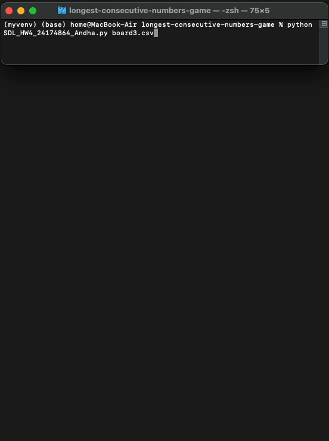

# Longest Sequence Finder

### App Description

This program takes in a .csv file consisting of a matrix of numbers and finds the longest consecutive sequence of numbers going
either horizontally, vertically, or diagonally. It also has a GUI element which displays the grid and highlights the longest
sequence when the user presses "Solve".

### App Demo

 

### Features

- Works with any matrix in the form of .csv
- Finds longest consecutive sequence
- GUI
- Displays the provided matrix
- Highlights the sequence found
